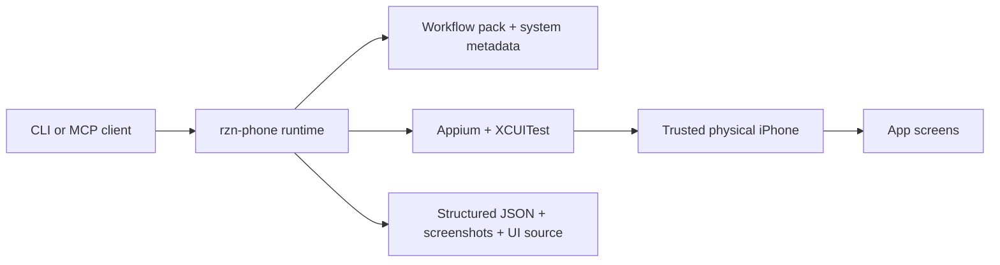

# rzn-phone

`rzn-phone` installs a local CLI and MCP worker for driving a real iPhone from macOS. It gives you named workflows for browsing, reading, extracting, and carefully gated actions across iOS apps without making you build your own Appium stack from scratch.

Public name is `rzn-phone`. Some RZN hosts expose the same capability as `rzn phone`.

## What you get

- A local `rzn-phone` CLI for `doctor`, `devices`, `workflow list`, `workflow run`, and `workflows update`
- An MCP server entrypoint via `rzn-phone worker`
- 51 shipped workflows covering Safari, App Store, Google Maps, Reddit, LinkedIn, Instagram, X, and Messages OTP lookup
- Read-oriented phone system tools for Messages, Calls, and Notifications
- Structured JSON outputs, plus screenshot/UI-source artifacts where the workflow returns them
- Updateable workflow packs so the runtime and workflows do not have to ship on the same cadence

## Why try it

Raw Appium is too low-level for repeatable product work. `rzn-phone` packages the annoying parts: device checks, session bootstrap, named workflows, artifacts, and safety gates. Try it if you want phone tasks that are installable, inspectable, and reusable instead of another private script graveyard.

## How it works

1. `rzn-phone doctor` checks the machine and iOS toolchain.
2. `rzn-phone devices` finds a trusted physical iPhone.
3. `rzn-phone workflow run <name> --udid <udid>` starts a session, runs a named workflow, and returns structured output.
4. Mutating steps stay behind two gates: a workflow-specific execute flag and runner-level `commit=true`.



## What you need

- macOS with Xcode and command line tools
- A trusted, unlocked physical iPhone
- Node.js plus Appium with the `xcuitest` driver
- App Store signed in on the device if you want stable App Store flows

If you are building from this repo instead of installing a shipped runtime, you also need Rust and Python 3.

## Install

Build and install from this repo:

```bash
make install
rzn-phone version
rzn-phone workflow list
```

Install from a staged release directory:

```bash
sh install.sh --source /absolute/path/to/release-dir
rzn-phone info
```

Useful runtime commands:

```bash
rzn-phone doctor
rzn-phone devices
rzn-phone workflow list
rzn-phone examples path
rzn-phone workflows update
```

## MCP setup

Use the installed wrapper as the server command:

```json
{
  "mcpServers": {
    "rzn-phone": {
      "command": "/absolute/path/to/rzn-phone",
      "args": ["worker"],
      "env": {
        "RZN_IOS_APPIUM_URL": "http://127.0.0.1:4723"
      }
    }
  }
}
```

## First run

Start with one read-only workflow:

```bash
rzn-phone doctor
rzn-phone devices
rzn-phone workflow run safari.google_search \
  --udid <udid> \
  --args-json '{"query":"best headphones 2026","limit":5}'
```

Then move to a domain workflow:

```bash
rzn-phone workflow run appstore.search_results \
  --udid <udid> \
  --args-json '{"query":"voice notes","limit":5,"target_app_name":"Voicenotes AI Notes & Meetings"}'
```

## Example flows

| Use case | Workflow | What you get |
| --- | --- | --- |
| Search the web in mobile Safari | `safari.google_search` | top results and on-device proof |
| Audit App Store search and listing quality | `appstore.typeahead`, `appstore.search_results`, `appstore.app_details`, `appstore.reviews`, `appstore.screenshots`, `appstore.version_history` | ranking, metadata, reviews, screenshots, version history |
| Pull a recent OTP from Messages | `phone_messages.find_recent_otp` | recent matching code without hand-driving the Messages UI |
| Inspect calls or notifications | `phone_calls.list_recent_calls`, `phone_notifications.list_recent_notifications`, `phone_notifications.filter_notifications_by_app` | read-only device state from core phone surfaces |
| Open a place or directions in Maps | `google_maps.open_place`, `google_maps.open_directions` | captured on-device state for place and route lookup |
| Build a social browsing digest | `reddit.daily_scroll_digest`, `linkedin.daily_scroll_digest`, `instagram.daily_scroll_digest`, `x.daily_scroll_digest` | structured feed rows for review or downstream ranking |
| Open a post or DM thread before acting | `*.open_post`, `*.open_inbox`, `*.open_dm_thread` | deterministic targeting without side effects |
| Draft or perform a gated social action | `reddit.comment_post`, `linkedin.create_post`, `instagram.send_dm`, `x.create_post` | dry-run first, then rerun with approval |

## System integrations

| Surface | What it exposes | Why it matters |
| --- | --- | --- |
| `rzn-phone` CLI | install, doctor, device listing, workflow execution, workflow refresh | terminal-first use without wiring raw JSON-RPC by hand |
| `rzn-phone worker` | stdio MCP server | plug into Codex, Claude-compatible clients, or any MCP-capable host |
| Workflow pack | versioned JSON workflows under `resources/workflows/` | named flows you can ship, inspect, and update |
| Phone systems | `phone_messages.*`, `phone_calls.*`, `phone_notifications.*` | read-oriented access to core phone surfaces |
| Social card catalogs | catalog-backed Reddit/LinkedIn/Instagram/X actions in `cards/social/` | one pattern for browse/read/engage flows across apps |
| Examples | starter payloads under `examples/` | copy, tweak, run |

## Safety model

Read-only flows are the default path. Mutating flows require both of these:

1. A workflow-specific execute flag such as `execute_comment`, `execute_like`, `execute_send`, or `submit`
2. `--commit 1` at runtime

That gives you a dry-run path by default:

```bash
rzn-phone workflow run linkedin.create_post \
  --udid <udid> \
  --args-json '{"text":"Draft only","submit":false}' \
  --commit 0
```

Cleanup controls are available on every workflow run:

- `--disconnect-on-finish 0|1`
- `--stop-appium-on-finish 0|1`
- `--background-on-exit 0|1`
- `--lock-device-on-exit 0|1`

## Current limits

- Local iOS automation is a macOS story because Xcode/XCUITest are a macOS story
- One active session at a time
- Native selectors are best-effort and may need tuning across app builds, locales, and device states
- Keep the phone unlocked during bootstrap and execution

## Architecture brief

Use this as diagram copy if you are rendering product graphics later.

**Runtime path**

- An operator or agent calls the installed `rzn-phone` CLI or mounts `rzn-phone worker` over MCP
- The runtime loads named workflows and system metadata from the installed package
- The worker talks to Appium/XCUITest on macOS
- Appium drives a trusted physical iPhone
- The run returns structured JSON and may include screenshots or full UI source

**Safety path**

- Read workflows can run directly
- Write workflows still load normally, but side-effectful steps are marked in the workflow
- The runtime only executes those steps when the workflow execute flag is true and the run also uses `commit=true`
- This creates a built-in dry-run -> inspect -> approve -> execute loop

**Update path**

- The runtime and the workflow pack are versioned separately
- `rzn-phone workflows update` refreshes workflows/examples without reinstalling the whole runtime
- This lets selector fixes and workflow additions ship faster than binary changes

## Repo notes

This README is the product surface. If you are working inside the repo, start here:

- Workflow format spec: [docs/specs/rzn_mobile_workflow_v1.md](docs/specs/rzn_mobile_workflow_v1.md)
- Social card spec: [docs/specs/rzn_social_card_v1.md](docs/specs/rzn_social_card_v1.md)
- Agent setup guide: [docs/agent_setup.md](docs/agent_setup.md)
- App notes: [App Store](docs/appstore_workflows.md), [Reddit](docs/reddit_workflows.md), [LinkedIn](docs/linkedin_workflows.md)
- Repo-local helper CLI: `./scripts/rzn_phone.sh`
- Build from source: `cargo build -p rzn_phone_worker --release`
- Build install artifacts: `make install-artifacts`
- Build runtime + signed bundle: `make release-artifacts`
- Public plugin release also requires backend publish registration; use `python3 scripts/publish_rzn_phone_release.py --channel stable --targets all` and the backend runbook at `/Users/sarav/Downloads/side/rzn/backend/docs/runbook/plugin_team_release_guide.md`
