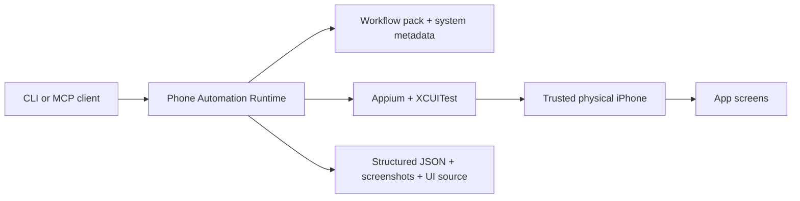

# RZN Phone Automation

Drive a real, logged-in iPhone from macOS through a local CLI or MCP server, either directly as a human or through an LLM/agent.

`rzn-phone` ships prebuilt workflows for common phone tasks such as interacting with Reddit, Instagram, and X, running Google searches in Safari, checking the App Store, getting OTPs from Messages, and more.

When the workflow you need does not exist yet, it gives you out-of-the-box phone primitives so you can still drive the device without dropping all the way down to raw Appium calls. Think Playwright or Puppeteer for browser automation, but for a real iPhone.

It is a higher-level layer on top of Appium + XCUITest that is easier for humans and LLMs to drive, inspect, and reuse. Once you have a flow working, you can turn it into a reusable workflow instead of keeping it as another one-off script.

This is for developers who need real phone automation without building their own pile of Appium glue, one-off scripts, and "wait why did it tap that?" debugging sessions.

## Why this exists

Most mobile automation stacks are built for one of two things:

- low-level control if you are willing to hand-roll Appium/XCUITest plumbing
- product QA if you are testing your own app in a conventional test harness

That is not the same job as "let a developer, operator, or agent do useful work on a real, logged-in iPhone and get structured output back."

`rzn-phone` is the layer in between. It gives you named workflows when the task is common, direct tools when it is not, and a local MCP surface so phone automation can plug into the same agent loops as the rest of your stack.

## Why install it

| If you are considering... | It is good at... | It breaks down when... | `rzn-phone` adds |
| --- | --- | --- | --- |
| Raw Appium / XCUITest | low-level device control | you need reusable agent workflows, safer writes, and sane defaults | shipped workflows, CLI, MCP, artifacts, commit gates |
| In-house scripts | one-off hacks that work once | you need discoverability, repeatability, and shared usage | named workflows, examples, history, favorites, structured JSON |
| Browser automation | Safari or web apps | the job crosses into App Store, Maps, Messages, or native social apps | real phone coverage instead of pretending the browser is enough |
| Conventional mobile test frameworks | regression testing your own app | you need to operate third-party apps and live account state | runtime built for operator and agent tasks, not test suites |

Blunt version: install this when you need real-phone automation to behave like a tool you can actually reuse, not a bag of selectors and regret.

## Best fit

| Use `rzn-phone` if... | Skip `rzn-phone` if... |
| --- | --- |
| you want a real physical iPhone, not a simulator story | you only need browser automation |
| you want both CLI and MCP access to the same runtime | you are only writing a normal XCTest / Detox / Appium test suite |
| you need prebuilt workflows but still want an escape hatch into direct tools | you need a cloud device farm or broad parallel test matrix |
| you care about dry-run by default and explicit approval for writes | you cannot satisfy the macOS + Xcode + physical-device requirements |
| you need logged-in app state, App Store research, social browsing, Maps, or phone surfaces like Messages/Calls/Notifications | you want a fully hosted service instead of a local operator runtime |

## What you get

- A local `rzn-phone` CLI for `run`, `list`, `show`, `recent`, favorites, completion scripts, `capability list`, direct `tool` calls, and workflow pack refreshes
- An MCP server entrypoint via `rzn-phone worker`, so Codex, Claude-style clients, or other MCP hosts can drive the runtime directly
- 51 shipped default workflows covering Safari, App Store, Google Maps, Reddit, LinkedIn, Instagram, X, and Messages OTP lookup
- A lower-level method surface through MCP tools such as `ios.*` and `phone_*`, so the shipped workflows are a starting point, not the ceiling
- Read-oriented phone system tools for Messages, Calls, and Notifications
- Structured JSON outputs, plus screenshot/UI-source artifacts where the workflow returns them
- Terminal-friendly output by default on TTY, with `--json` when you want raw machine-readable payloads
- Updateable workflow packs so the runtime and workflows do not have to ship on the same cadence

## How it works

1. `rzn-phone doctor` checks the machine and iOS toolchain.
2. `rzn-phone devices` finds a trusted physical iPhone.
3. `rzn-phone run <system> <workflow> --udid <udid>` or `rzn-phone run system/workflow --udid <udid>` starts a session, runs a named workflow, and returns structured output.
4. Mutating steps stay behind two gates: a workflow-specific execute flag and runner-level `commit=true`.


```mermaid
flowchart LR
  A["CLI or MCP client"] --> B["Phone Automation Runtime"]
  B --> C["Workflow pack + system metadata"]
  B --> D["Appium + XCUITest"]
  D --> E["Trusted physical iPhone"]
  E --> F["App screens"]
  B --> G["Structured JSON + screenshots + UI source"]
```

## Prerequisites

`rzn-phone` is built on top of Appium and the XCUITest driver. It is not trying to replace that stack. It packages it into something humans and LLMs can actually use.

- macOS with Xcode and command line tools
- A trusted, unlocked physical iPhone
- Node.js plus Appium with the `xcuitest` driver
- App Store signed in on the device if you want stable App Store flows

If you are installing the shipped runtime, you do not need Python for `rzn-phone` itself. If you are building release artifacts from this repo, you still need Rust and Python 3 for the repo tooling.

## Install

Build and install from this repo:

```bash
make install
rzn-phone version
rzn-phone list
rzn-phone list --compact
rzn-phone list --family extract
rzn-phone capability list
rzn-phone completion zsh
rzn-phone tool list --direct
```

Install from a staged release directory:

```bash
sh install.sh --source /absolute/path/to/release-dir
rzn-phone info
```

Useful runtime commands:

```bash
rzn-phone doctor
rzn-phone devices
rzn-phone status
rzn-phone run safari google_search --args-json '{"query":"best headphones 2026","limit":5}'
rzn-phone shutdown
rzn-phone run safari google_search --args-json '{"query":"best headphones 2026","limit":5}' --fast 0
rzn-phone list
rzn-phone list --search review --mutating
rzn-phone list --favorites
rzn-phone show safari/google_search --example
rzn-phone show ios.session.create
rzn-phone recent
rzn-phone history clear
rzn-phone history redact
rzn-phone rerun 1
rzn-phone favorite add safari/google_search
rzn-phone list --family extract
rzn-phone show safari/google_search
rzn-phone capability list
rzn-phone tool show ios.ui.observe_compact
rzn-phone tool call ios.capability.list
rzn-phone tool call ios.workflow.list
rzn-phone examples path
rzn-phone workflows update
```

Local history is private-by-default: `~/.rzn-phone` and `history.jsonl` are written with restrictive Unix permissions, and persisted run args are redacted for phone numbers, emails, OTP-like codes, message bodies, secrets, and auth-looking values. Set `RZN_PHONE_HISTORY=off` or `RZN_PHONE_HISTORY_DISABLED=1` to disable recording. Use `rzn-phone history clear` to delete local history, `rzn-phone history redact` to rewrite older entries with the current redaction policy, and `RZN_PHONE_STATE_DIR=/path` to move local state.

Failure artifacts default to `RZN_IOS_FAILURE_ARTIFACTS=minimal`, which records redacted failure metadata only. Use `RZN_IOS_FAILURE_ARTIFACTS=off` for no local failure artifacts or `RZN_IOS_FAILURE_ARTIFACTS=full` when you explicitly want screenshots and UI source for debugging.

## Capability tiers

`rzn-phone` now exposes a two-tier model so agents do not have to plan against a flat wall of 50 low-level verbs:

| Tier | Audience | Examples |
|---|---|---|
| 1 | planner / LLM | `observe`, `navigate`, `extract`, `interact`, `verify`, `session` |
| 2 | runtime / executor | `ios.ui.observe_compact`, `ios.web.goto`, `ios.web.eval_js`, `ios.action.tap` |

Use `rzn-phone capability list` or `ios.capability.list` to inspect the grouped taxonomy. Use `rzn-phone list` when you want the full workflow catalog grouped by system, `rzn-phone list google` when you want the CLI to treat a positional token as either an exact system id or a fallback search query, `rzn-phone list --search review --mutating` when you want to narrow it fast, or `rzn-phone list --family extract` when you want prebuilt workflows narrowed to one planning family.

## CLI Quality Of Life

- TTY-first output: `list`, `show`, `tool list`, `tool show`, `capability list`, and `devices` render readable terminal output by default when stdout is a TTY. Add `--json` to force raw JSON. Add `--pretty` to force the richer human renderer even when the terminal reports itself badly.
- Agent-safe plain mode: those same help/catalog commands now stay text-first even when stdout is not a TTY, so pipes and agents do not get shoved into bloated JSON unless `--json` is explicit. Set `RZN_CLI_PLAIN=1` to force plain mode.
- Search and filters: `rzn-phone list` supports `--search`, `--family`, `--surface`, `--has-input`, `--mutating`, `--favorites`, and `--compact`. A positional token such as `rzn-phone list google` first tries an exact system id and falls back to search when no system matches. `rzn-phone tool list` supports `--search`, `--family`, `--tier`, and `--direct`.
- Short aliases: `rzn-phone show <ref>` shows either a workflow or a tool. `rzn-phone tools` is an alias for `rzn-phone tool list`.
- Suggestions: mistyped workflow refs, tool names, and top-level commands now return “did you mean” suggestions instead of dead-end errors.
- Safer runs: `rzn-phone run ... --dry-run` is the human-facing alias for `--commit 0`.
- Less UDID tax: if exactly one physical device is available, `rzn-phone run ...` auto-selects it. Set `RZN_IOS_DEFAULT_UDID` if you want a sticky default.
- Progressive workflow help: filtered `list` output now shows a compact input contract, while `rzn-phone show safari/google_search` prints core inputs, safety gates, advanced knobs, notes, and a runnable quick-start example. Add `--example` for the full example set when a workflow provides it.
- History and favorites: `rzn-phone recent`, `rzn-phone rerun <n>`, `rzn-phone favorite add <ref>`, and `rzn-phone list --favorites`.
- Shell completion: `rzn-phone completion bash` or `rzn-phone completion zsh`.

## MCP setup

Use the installed wrapper as the server command:

```json
{
  "mcpServers": {
    "rzn-phone": {
      "command": "/absolute/path/to/rzn-phone",
      "args": ["worker"],
      "env": {
        "RZN_IOS_APPIUM_URL": "http://127.0.0.1:4723"
      }
    }
  }
}
```

## First run

Start with one read-only workflow:

```bash
rzn-phone doctor
rzn-phone devices
rzn-phone run safari google_search \
  --args-json '{"query":"best headphones 2026","limit":5}'
```

Then move to a domain workflow:

```bash
rzn-phone run appstore/search_results \
  --args-json '{"query":"voice notes","limit":5,"target_app_name":"Voicenotes AI Notes & Meetings"}'
```

Workflow ids stay canonical as `system/workflow` for commands, docs, and copy-paste. Grouped catalog views intentionally show only the short workflow name inside each system section, because repeating `appstore/...` under an `appstore` header is visual clutter.

## Direct Tools

If no shipped workflow fits, drive the phone directly instead of inventing a one-off wrapper:

```bash
rzn-phone tool list --direct
rzn-phone tool list --direct --search session
rzn-phone tool show ios.session.create
rzn-phone tool call ios.appium.ensure
rzn-phone tool call ios.session.create --args-json '{"udid":"<udid>","kind":"native_app","bundleId":"com.apple.mobilesafari"}'
rzn-phone tool call ios.ui.observe_compact --args-json '{"maxNodes":120}'
```

The direct loop is simple:

1. Ensure Appium.
2. Create or reuse a session.
3. Observe with `ios.ui.observe_compact`.
4. Act with `ios.action.*` or `ios.web.*`.
5. Re-observe and verify before the next step.

## Example flows

| Use case | Workflow | What you get |
| --- | --- | --- |
| Search the web in mobile Safari | `safari/google_search` | top results and on-device proof |
| Audit App Store search and listing quality | `appstore/typeahead`, `appstore/search_results`, `appstore/app_details`, `appstore/reviews`, `appstore/screenshots`, `appstore/version_history` | ranking, metadata, reviews, screenshots, version history |
| Pull a recent OTP from Messages | `phone_messages/find_recent_otp` | recent matching code without hand-driving the Messages UI |
| Inspect calls or notifications | `phone_calls/list_recent_calls`, `phone_notifications/list_recent_notifications`, `phone_notifications/filter_notifications_by_app` | read-only device state from core phone surfaces |
| Open a place or directions in Maps | `google_maps/open_place`, `google_maps/open_directions` | captured on-device state for place and route lookup |
| Build a social browsing digest | `reddit/daily_scroll_digest`, `linkedin/daily_scroll_digest`, `instagram/daily_scroll_digest`, `x/daily_scroll_digest` | structured feed rows for review or downstream ranking |
| Open a post or DM thread before acting | `*/open_post`, `*/open_inbox`, `*/open_dm_thread` | deterministic targeting without side effects |
| Draft or perform a gated social action | `reddit/comment_post`, `linkedin/create_post`, `instagram/send_dm`, `x/create_post` | dry-run first, then rerun with approval |

## System integrations

| Surface | What it exposes | Why it matters |
| --- | --- | --- |
| `rzn-phone` CLI | install, doctor, device listing, workflow execution, direct tool calls, workflow refresh | terminal-first use without wiring raw JSON-RPC by hand |
| `rzn-phone worker` | stdio MCP server | plug into Codex, Claude-compatible clients, or any MCP-capable host |
| Workflow pack | versioned JSON workflows under `resources/workflows/` | named flows you can ship, inspect, and update |
| Phone systems | `phone_messages.*`, `phone_calls.*`, `phone_notifications.*` | read-oriented access to core phone surfaces |
| Social card catalogs | catalog-backed Reddit/LinkedIn/Instagram/X actions in `cards/social/` | one pattern for browse/read/engage flows across apps |
| Examples | starter payloads under `examples/` | copy, tweak, run |

## Safety model

Read-only flows are the default path. Mutating flows require both of these:

1. A workflow-specific execute flag such as `execute_comment`, `execute_like`, `execute_send`, or `submit`
2. `--commit 1` at runtime

That gives you a dry-run path by default:

```bash
rzn-phone run linkedin/create_post \
  --udid <udid> \
  --args-json '{"text":"Draft only","submit":false}' \
  --commit 0
```

Cleanup controls are available on every workflow run:

- `--disconnect-on-finish 0|1`
- `--stop-appium-on-finish 0|1`
- `--fast 0|1`
- `--background-on-exit 0|1`
- `--lock-device-on-exit 0|1`

`rzn-phone run ...` now uses a short-lived smart cache by default. If the last compatible Appium/WDA/session state is still warm, the next run quietly reuses it instead of paying the full bootstrap cost again. If the cache is stale or unhealthy, the runtime tears it down and falls back to a clean cold start.

Typical loop:

```bash
rzn-phone run safari google_search \
  --udid <udid> \
  --args-json '{"query":"best headphones 2026","limit":5}'

rzn-phone run safari google_search \
  --udid <udid> \
  --args-json '{"query":"noise cancelling earbuds","limit":5}'

rzn-phone status
rzn-phone shutdown
```

Notes:

- The default cache window is 5 minutes after last use. Set `RZN_IOS_RUNTIME_CACHE_TTL_SECS` to change it.
- Set `RZN_IOS_SMART_CACHE=0` if you want the old always-cold behavior by default.
- `--fast 0` disables smart caching for one run.
- `--fast 1` forces reuse behavior on even if you have disabled the default cache via env.
- Use `rzn-phone shutdown` when you want to tear everything down cleanly.
- If the persisted session is stale, the runtime drops it and creates a fresh one automatically.

## Current limits

- Local iOS automation is a macOS story because Xcode/XCUITest are a macOS story
- One active session at a time
- Native selectors are best-effort and may need tuning across app builds, locales, and device states
- Keep the phone unlocked during bootstrap and execution

## Architecture brief

Use this as diagram copy if you are rendering product graphics later.

**Runtime path**

- An operator or agent calls the installed `rzn-phone` CLI or mounts `rzn-phone worker` over MCP
- The runtime loads named workflows and system metadata from the installed package
- The worker talks to Appium/XCUITest on macOS
- Appium drives a trusted physical iPhone
- The run returns structured JSON and may include screenshots or full UI source

**Safety path**

- Read workflows can run directly
- Write workflows still load normally, but side-effectful steps are marked in the workflow
- The runtime only executes those steps when the workflow execute flag is true and the run also uses `commit=true`
- This creates a built-in dry-run -> inspect -> approve -> execute loop

**Update path**

- The runtime and the workflow pack are versioned separately
- `rzn-phone workflows update` refreshes workflows/examples without reinstalling the whole runtime
- This lets selector fixes and workflow additions ship faster than binary changes

## Repo notes

This README is the product surface. If you are working inside the repo, start here:

- Workflow format spec: [docs/specs/rzn_mobile_workflow_v1.md](docs/specs/rzn_mobile_workflow_v1.md)
- Social card spec: [docs/specs/rzn_social_card_v1.md](docs/specs/rzn_social_card_v1.md)
- Agent setup guide: [docs/agent_setup.md](docs/agent_setup.md)
- App notes: [App Store](docs/appstore_workflows.md), [Reddit](docs/reddit_workflows.md), [LinkedIn](docs/linkedin_workflows.md)
- Build from source: `cargo build -p rzn_phone_worker --release`
- Build install artifacts: `make install-artifacts`
- Build runtime + signed bundle: `make release-artifacts`
- Public plugin release also requires backend publish registration through the private RZN backend release runbook.

## License

`rzn-phone` is licensed under the GNU Affero General Public License v3.0 only (`AGPL-3.0-only`). See [LICENSE](LICENSE).
