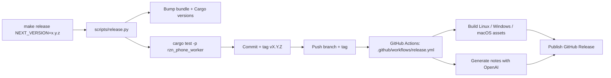

# Releasing `rzn-phone`



## Strong Take

This release flow cuts a real GitHub release. It does not pretend Linux or Windows can run Xcode.
The asset story is honest:

| Asset | What it is | Reality |
| --- | --- | --- |
| `rzn-phone-<version>-macos_universal.tar.gz` | Full `rzn-phone` runtime bundle | The real local iOS automation runtime |
| `rzn-phone-install.sh` | Flat GitHub-release installer helper | Pipes into `sh` with a direct `--archive` URL |
| `rzn-phone-worker-<version>-macos_x86_64.tar.gz` | Intel macOS standalone worker bundle | For arch-specific installs and debugging |
| `rzn-phone-worker-<version>-macos_arm64.tar.gz` | Apple Silicon standalone worker bundle | Same worker bundle, native arm64 |
| `rzn-phone-worker-<version>-linux_x86_64.tar.gz` | Linux standalone worker bundle | Good for controller / remote-host scenarios |
| `rzn-phone-worker-<version>-windows_x86_64.zip` | Windows standalone worker bundle | Same controller / remote-host story |
| `rzn-phone-workflows-<version>.tar.gz` | Workflows, systems metadata, examples | Shared content pack |

## Release Command

```bash
make release NEXT_VERSION=0.2.0
```

What it does:

1. Verifies version sync and a clean git tree.
2. Requires the release to be cut from `main`.
3. Pulls `origin/main` with rebase.
4. Bumps `plugin_bundle/rzn-phone.bundle.json` and `crates/rzn_phone_worker/Cargo.toml`.
5. Runs `cargo test -p rzn_phone_worker`.
6. Commits `Release vX.Y.Z`, creates tag `vX.Y.Z`, pushes branch and tag.
7. Lets GitHub Actions do the slow part: build, notes, publish.

Preview it without touching git:

```bash
make release-dry-run NEXT_VERSION=0.2.0
```

## GitHub Actions Setup

One-time repo setup:

| Setting | Where | Why |
| --- | --- | --- |
| `OPENAI_API_KEY` | GitHub Actions secret | Enables LLM-written release notes |
| `OPENAI_RELEASE_NOTES_MODEL` | GitHub Actions repo variable | Optional override for the release-notes model |

The workflow falls back to a deterministic git summary if `OPENAI_API_KEY` is missing or the API call fails. Broken release notes should not block shipping.

## Public Install

GitHub release assets are flat files, so install with a direct archive URL:

```bash
TAG="v0.2.0"
VERSION="${TAG#v}"
BASE="https://github.com/srv1n/rzn-phone/releases/download/${TAG}"

curl -fsSL "$BASE/rzn-phone-install.sh" | sh -s -- \
  --version "$VERSION" \
  --archive "$BASE/rzn-phone-${VERSION}-macos_universal.tar.gz"
```

## Public Repo Reality

Making the repo public is not the same as licensing it. If you want people to legally reuse the code, pick an actual license. Public without a license is source-visible, not open source.
