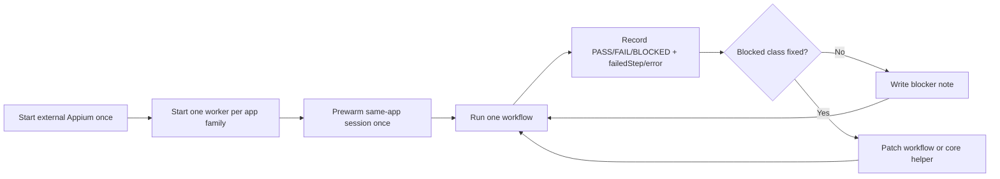

# Repeatable Workflow Validation Notes

This is the blunt version. The validation loop went off the rails whenever we mixed:

- a fresh worker process per flow
- fresh WDA/Appium bring-up per flow
- geometry from one scroll pass with taps on a different scroll pass

That combination is poison. The fix is not more heroic debugging. The fix is a repeatable loop.

## Validation Loop

## What Already Needs To Be In Core

| Area | Problem | Core update |
|---|---|---|
| Worker/Appium ownership | `RZN_IOS_APPIUM_URL` was being treated like disposable local state and got shut down on session-create failures. | Never kill env-owned Appium from worker cleanup. Spawned Appium is ours. Env Appium is not. |
| Repo validation path | Validation was hitting stale `libexec/rzn-phone-worker` instead of the freshly built `target/release/rzn-phone-worker`. | Prefer the newer repo build automatically when running from source. |
| Live validation harness | One shell process per workflow hid failures and made session reuse impossible. | Use a persistent worker per app family and keep status at the workflow boundary, not the shell boundary. |
| Device transport preflight | We were wasting flow runs to discover the phone was offline in Apple tooling. | Family validation should probe the target UDID with `xctrace` first and mark the family `BLOCKED` before any workflow run. |
| Session prewarm | Prewarm used to treat any RPC response as success, even when `ios.session.create` had already failed. | Prewarm must inspect structured success and block the family immediately on session-create failure. |
| WDA code 65 diagnosis | `xcodebuild` code 65 was too coarse and kept getting mislabeled as signing or device lock. In at least one real failure, the actual clue was `Timed out while enabling automation mode.` | Harvest the latest WDA `scheduling.log` / `testmanagerd.log` clue automatically and surface it in validation output. |
| Runtime persistence | Cross-process reuse only works when persistence is explicitly enabled. | Keep persistence rules obvious and centralized; family validators should always opt in. |
| Scroll-scan targeting | `extract_rows` can hand back candidates discovered on an earlier scroll pass, but workflows later tap on the final screen. That is stale geometry. | Add a first-class "select on current pass only" or "resync selected row on current viewport" primitive. Do not make workflows guess. |
| Focus-mutating inputs | Some iOS surfaces replace the focused field node after tap. `typeahead` was failing because it re-found the old node and then pretended the field was gone. | Input helpers should fall back to the driver's active element when the originally targeted field mutates after focus. |
| Semantic target validation | A flow can return `PASS` while opening the wrong app or ad slot. That is fake green. | Validation should check target identity in the output when a workflow claims to open a specific app/entity, not just that some downstream extraction succeeded. |
| Workflow targeting | Many flows still use app-specific selectors directly in action steps. | Keep app-specific selectors in workflow packs, but add generic helpers for resync, current-viewport selection, and safe row targeting so the workflows stop duplicating bad patterns. |

## What Does Not Belong In Core

Do not put:

- `if reddit then ...`
- `if linkedin then ...`
- app-specific selector fallbacks
- site/app-specific presentational hacks

Core should own:

- session lifecycle
- worker/Appium ownership rules
- current-viewport extraction
- resync after scroll
- geometry helpers
- failure classification
- family-level validation plumbing

Workflow packs should own:

- selectors
- extractor contracts
- fallback order
- presentation metadata

## Immediate Fixes That Helped

| Fix | Why it mattered |
|---|---|
| `reuseActiveSession=true` + `replaceExisting=false` across the Reddit family | Same app, same device, same worker. Recreating every session was pointless and flaky. |
| External Appium shutdown fix | Stopped the worker from nuking the manually started Appium server after a failed run. |
| Runtime script preferring newer `target/release` builds | Stopped validation from reporting against old binaries. |
| Persistent family validator | Makes failures show up as `failedStep/error` instead of "the whole shell hung". |
| Automatic WDA clue extraction | Turns a generic `code 65` blocker into a specific clue like `Timed out while enabling automation mode.` |
| Active-element fallback in input helpers | Fixed App Store `typeahead` on a surface that swaps the focused field node after tap. |
| Ranked target selection for App Store app flows | Stopped `app_details` / `reviews` / `screenshots` / `version_history` from blindly opening ads or the wrong app. |

## Open Core Work Items

1. Add a current-viewport row selector primitive so workflows can choose a row after scrolling without acting on stale coordinates.
2. Add a generic "resync selected candidate on current screen" tool. This should take previously extracted structured data and reacquire the live node before tapping.
3. Make family validation first-class in the CLI instead of hiding it in ad hoc scripts.
4. Distinguish `PASS`, `FAIL`, and `BLOCKED` at the worker level, not only in outer scripts.
5. Expose richer row metadata for visible text-bearing descendants so workflows do not have to reverse-engineer tappable title regions.
6. Add a worker-level device transport probe so `ios.session.create` can say "device offline in xctrace" instead of only surfacing Appium's vague UDID errors.
7. Pull WDA diagnostics into the worker/runtime layer too, not just the family validator, so `ios.session.create` can return actionable startup clues directly.

## Current Rule

When a flow blocks:

1. Capture `failedStep`, `error`, and the failure UI source.
2. Classify the blocker.
3. Fix that blocker class once.
4. Re-run only the affected family.

Anything else is just going in circles with more CPU. 
