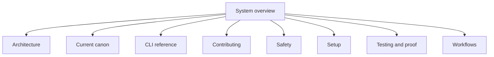

# System overview

This page is the top-level map for RZN Phone Automation. It is a local CLI and
MCP worker for a real iPhone. The worker uses Appium and XCUITest.

Read the pages in this order:

1. [Setup](setup.md) to prepare a Mac and an iPhone.
2. [Architecture](architecture.md) to follow the runtime path.
3. [Workflows](workflows.md) to add or change a workflow.
4. [Safety](safety.md) before any write action.
5. [CLI reference](cli.md) for the command surface.
6. [Testing and proof](testing.md) for checks and proof boundaries.
7. [Current canon](canon.md) for source authority.
8. [Contributing](contributing.md) for the change and check loop.

This folder is the current answer for the whole repository. Source code and
workflow data remain the authority for behavior.

<!-- tusker:docs-map:begin -->

<!-- tusker:docs-map:end -->
