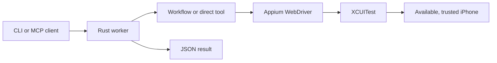

# Architecture

## Runtime path

The CLI and the MCP worker use the same Rust library. A workflow is data. A
direct tool is Rust code. Both share `AppState` and the policy module, but
direct calls and workflow steps use different policy contexts.

## Repository parts

| Path | Role |
| --- | --- |
| `crates/rzn_phone_worker/src/lib.rs` | Worker entry and shared library. |
| `crates/rzn_phone_worker/src/bin/rzn-phone.rs` | Terminal CLI entry. |
| `crates/rzn_phone_worker/src/mcp.rs` | MCP protocol and prompts. |
| `crates/rzn_phone_worker/src/tools/` | Direct tool families and policy checks. |
| `crates/rzn_phone_worker/src/workflows.rs` | Workflow loading and execution. |
| `crates/rzn_phone_worker/src/state.rs` | Local session and Appium state. |
| `crates/rzn_phone_worker/resources/workflows/` | Current workflow JSON. |
| `crates/rzn_phone_worker/resources/systems/` | System metadata for phone-data surfaces. |
| `plugin_bundle/` | Bundle manifest and packaging inputs. |
| `scripts/` | Build, validation, install, and release helpers. |

## One run

1. The client selects a workflow or a direct tool.
2. The worker loads the installed workflow pack. It also checks workflow roots
   from `RZN_IOS_WORKFLOW_DIRS`, plugin roots, and the repository fallback.
   Invalid JSON is skipped and reported.
3. The worker finds a healthy Appium endpoint or starts one locally.
4. Session creation starts WebDriverAgent by default. It reuses a matching
   live session only when the caller asks for reuse.
5. The worker observes the screen, performs a step, and checks the result.
6. The worker returns JSON. A failed tool call is a structured result with
   `isError`, an error code, and details. Raw screenshots and UI source are
   optional failure artifacts, not the default.

The CLI smart-cache path may reuse a healthy session for five minutes. It opts
into persisted runtime state only when its fast path is active. A plain MCP
worker keeps state in memory unless `RZN_IOS_PERSIST_RUNTIME` is set. Use
`rzn-phone shutdown` only after the cleanup command has the required commit
approval; see [Safety](safety.md).

## Runtime state

CLI history and favorites use the platform state directory. Set
`RZN_PHONE_STATE_DIR` to override it; the default follows
`crates/rzn_phone_worker/src/config.rs`. Persisted runtime state is written
there only when persistence or the CLI smart cache enables it. The installed
runtime data directory follows the platform data directory and the same
configuration module.

The MCP worker uses JSON-lines on standard input and output. It supports tool
list/call, prompts, and stub resource methods. The resource list is empty.
Tool failures are returned inside the normal result with `isError`; they are
not JSON-RPC transport errors.

Do not treat generated build output, runtime state, or task records as product
source. Change Rust code, workflow JSON, schemas, or scripts instead.
