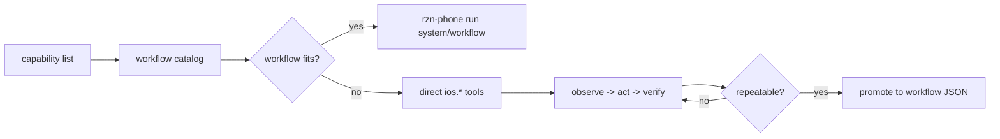

# RZN Phone Automation

Use this skill when the task needs a real, logged-in iPhone. The default interface is the public `rzn-phone` CLI. Authoring or debugging workflows is a secondary mode; the first job is to solve the phone task safely.

## Start Here

1. Bootstrap only if the runtime is missing, stale, or unclear:

```bash
scripts/bootstrap_runtime.sh
```

2. Verify the direct CLI surface:

```bash
rzn-phone doctor
rzn-phone devices
rzn-phone capability list
rzn-phone list --compact
rzn-phone tool list --direct
```

3. Pick the smallest path that solves the phone task:

| Need | Path |
| --- | --- |
| A shipped phone workflow exists | Run the named workflow |
| The flow is close but selectors/args need tuning | Inspect nearby workflow JSON and edit the pack |
| No workflow fits yet | Use the LLM-auto/autonomy loop with direct `ios.*` tools |
| The direct loop becomes repeatable | Promote it into workflow JSON |

## When Not To Use This

- The task is normal web research or browser automation on desktop.
- The user only needs a generic Appium/XCTest/Detox regression test for their own app.
- A simulator is enough and no physical logged-in iPhone state matters.
- The action would mutate phone/app state and the user has not clearly approved it.

Read only what the task needs:

- `references/cli-playbook.md` for direct CLI commands, workflow runs, and autonomy-loop examples.
- `references/authoring.md` before editing or creating workflow JSON.
- `references/docs-map.md` to route into repo docs without dumping the whole repo into context.
- `references/troubleshooting.md` for Appium, Xcode, WDA, device, and workflow-pack failures.

## Operating Rules

- Prefer an existing workflow before writing a new one.
- Use canonical slash ids in prompts and commands: `system/workflow`.
- Preserve legacy dot-form `name` fields inside existing JSON unless a deliberate migration is part of the task.
- Keep app-specific selectors in workflow JSON, not Rust core, unless the defect is truly generic runtime behavior.
- Default to read-only or dry-run. Mutating workflows need both an execute arg such as `execute_like=true` and the runner gate `--commit 1`.
- Re-observe after every scroll, navigation, modal open, or state change before tapping. Stale geometry is where automation gets dumb.
- Use runner cleanup flags (`--disconnect-on-finish`, `--background-on-exit`, `--lock-device-on-exit`) instead of hardcoding teardown into workflow JSON.
- Use repo-local wrapper scripts only as maintainer conveniences. The reusable skill path should be direct `rzn-phone ...` CLI or MCP tools.

## Workflow Path

```bash
rzn-phone list --search review
rzn-phone show appstore/search_results --example
rzn-phone run appstore/search_results \
  --args-json '{"query":"voice notes","limit":5}' \
  --json
```

For mutating workflows, dry-run first:

```bash
rzn-phone run linkedin/comment_post \
  --args-json '{"comment_text":"Thanks for sharing this.","execute_comment":false}' \
  --dry-run \
  --json
```

Only run the real action after explicit approval:

```bash
rzn-phone run linkedin/comment_post \
  --args-json '{"comment_text":"Thanks for sharing this.","execute_comment":true}' \
  --commit \
  --json
```

## LLM-Auto / Autonomy Path

There is no separate `rzn-phone llm-auto` command in this repo. The phone equivalent is the `ios.autonomy.loop` MCP prompt plus the same loop exposed through CLI direct tools:



CLI equivalent:

```bash
rzn-phone tool call ios.appium.ensure
rzn-phone tool call ios.session.create \
  --args-json '{"udid":"<udid>","kind":"native_app","bundleId":"com.apple.mobilesafari"}'
rzn-phone tool call ios.ui.observe_compact --args-json '{"maxNodes":120}'
rzn-phone tool call ios.action.tap --args-json '{"target":{"encodedId":"btn_1"}}'
rzn-phone tool call ios.ui.observe_compact --args-json '{"maxNodes":120}'
```

If an MCP client supports prompts, ask it for `ios.autonomy.loop` with the task objective. It tells the agent to check Tier-1 capabilities, prefer workflows, then fall back to short `ios.*` observe-act-verify loops.

## Stop And Ask

- Apple signing or provisioning is blocked and human-owned values are required.
- No repo root, installed runtime, or release artifact exists, so there is nothing real to install from.
- A mutating run is requested but approval is ambiguous.
- The failure looks like core session/observe/scroll runtime behavior, not a workflow bug. Say that instead of burying it under selectors.
